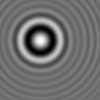
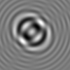
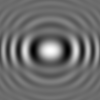
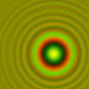

.. _calc_tutorial:

Scattering Calculations
=======================

Optical physicists and astronomers have worked out how to compute the
scattering of light from many kinds of objects.  HoloPy provides an
easy interface for computing scattered fields, intensities, scattering
matrices, cross-sections, and holograms generated by microscopic objects.

A Simple Example
~~~~~~~~~~~~~~~~

Let's start by calculating an in-line hologram generated by a
plane wave scattering from a microsphere.

.. plot:: pyplots/calc_sphere.py
   :include-source:

(You may need to call ``matplotlib.pyplot.show()`` if you can't see the hologram after running this code.)

To calculate a hologram, HoloPy needs to know two things: the *scatterer* that is scattering the light and the *experimental setup* under which the hologram is recorded. With those two, HoloPy chooses an appropriate *scattering theory* that calculates the hologram from the scatterer and the experimental setup; advanced users may want to choose the theory themselves. We'll examine each section of code in turn.

The first few lines :

..  testcode::

    import holopy as hp
    from holopy.scattering import calc_holo, Sphere

load the relevant modules from HoloPy that we'll need for doing our
calculation.

The next line describes the *scatterer* we would like to model:

..  testcode::

    sphere = Sphere(n=1.59, r=0.5, center=(4, 4, 5))

Scatterers are described in HoloPy by a :class:`.Scatterer` object. Here, we use a :class:`.Sphere` as the scatterer object. A :class:`.Scatterer` object
contains information about the geometry (position, size, shape) and optical
properties (refractive index) of the object that is scattering light. We've
defined a spherical scatterer with radius 0.5 microns and index of refraction
1.59. This refractive index is approximately that of polystyrene.

Next, we need to describe the *experimental setup*, including how we are
illuminating our sphere, and how that light will be detected:

..  testcode::

    medium_index = 1.33
    illum_wavelen = 0.66
    illum_polarization = (1, 0)
    detector = hp.detector_grid(shape=100, spacing=0.1)

We are going to be using red light (wavelength = 660 nm in vacuum) polarized in
the x-direction to illuminate a sphere immersed in water (refractive index =
1.33). Refer to :ref:`units` and :ref:`coordinate_system` if you're confused
about how the wavelength and polarization are specified.

The scattered light will be collected at a detector, which is frequently a
digital camera mounted onto a microscope.  We defined our detector as a 100 x
100 pixel array, with each square pixel of side length .1 microns.  The
``shape`` argument tells HoloPy how many pixels are in the detector and affects
computation time. The ``spacing`` argument tells HoloPy how far apart each
pixel is. Both parameters affect the absolute size of the detector.

Finally, we need to specify the *scattering theory* which knows how to calculate the hologram from the experimental setup and the scatterer. By setting ``theory='auto'``, we let HoloPy automatically select a theory. If no theory is specified, HoloPy will automatically select a theory as well.

After getting everything ready, the actual scattering calculation is straightforward:

..  testcode::

    holo = calc_holo(detector, sphere, medium_index, illum_wavelen,
                     illum_polarization, theory='auto')
    hp.show(holo)

Congratulations! You just calculated the in-line hologram generated at the
detector plane by interference between the scattered field and the reference
wave. For an in-line hologram, the reference wave is simply the part of the
field that is not scattered or absorbed by the particle.

..  testcode::
    :hide:

    print(holo[0,0].values[0])

..  testoutput::
    :hide:

    1.01201...

You might have noticed that our scattering calculation requires much of the same
metadata we specified when loading an image. If we have an experimental image
from the system we would like to model, we can use that as an argument in
:func:`.calc_holo` instead of our ``detector`` object created from
:func:`.detector_grid`. HoloPy will calculate a hologram image with pixels at
the same positions as the experimental image, and so we don't need to worry
about making a :func:`.detector_grid` with the correct ``shape`` and ``spacing``
arguments.

..  testcode::

    from holopy.core.io import get_example_data_path
    imagepath = get_example_data_path('image0002.h5')
    exp_img = hp.load(imagepath)
    holo = calc_holo(exp_img, sphere)

..  testcode::
    :hide:

    print(exp_img.shape)
    print(holo[0,0].values[0])

..  testoutput::
    :hide:

    (1, 100, 100)
    1.0120178...

Note that we didn't need to explicitly specify illumination information when
calling :func:`.calc_holo`, since our image contained saved metadata and HoloPy
used its values. Passing an image to a scattering function is particularly
useful when comparing simulated data to experimental results, since we can
easily recreate our experimental conditions exactly.

So far all of the images we have calculated are holograms, or the interference
pattern that results from the superposition of a scattered wave with a reference
wave. Holopy can also be used to examine scattered fields on their own. Simply
replace :func:`.calc_holo` with :func:`.calc_field` to look at scattered
electric fields (complex) or :func:`.calc_intensity` to look at field
amplitudes, which is the typical measurement in a light scattering experiment.

.. _more_scattering_ex:

More Complex Scatterers
~~~~~~~~~~~~~~~~~~~~~~~

Let's proceed to a few examples with different :class:`.Scatterer` objects.
You can find a more thorough desccription of all their functionalities in the
user guide on :ref:`scatterers_user`.

Coated Spheres
--------------

HoloPy can also calculate holograms from coated (or multilayered) spheres.
Constructing a coated sphere differs only in specifying a
list of refractive indices and outer radii corresponding to the layers
(starting from the core and working outwards).

..  testcode::

    coated_sphere = Sphere(center=(2.5, 5, 5), n=(1.59, 1.42), r=(0.3, 0.6))
    holo = calc_holo(exp_img, coated_sphere)
    hp.show(holo)

..  testcode::
    :hide:

    print(holo[0,0,0].values)

..  testoutput::
    :hide:

    0.97506085...

If you prefer thinking in terms of the thickness of subsequent layers, instead
of their distance from the center, you can use :class:`.LayeredSphere` to achieve the same result:

..  testcode::

    from holopy.scattering import LayeredSphere
    coated_sphere = LayeredSphere(center=(2.5, 5, 5), n=(1.59, 1.42), t=(0.3, 0.3))

Collection of Spheres
---------------------

If we want to calculate a hologram from a collection of spheres, we must
first define the spheres individually, and then combine them into a
:class:`.Spheres` object:

..  testcode::

    from holopy.scattering import Spheres
    s1 = Sphere(center=(5, 5, 5), n = 1.59, r = .5)
    s2 = Sphere(center=(4, 4, 5), n = 1.59, r = .5)
    collection = Spheres([s1, s2])
    holo = calc_holo(exp_img, collection)
    hp.show(holo)

..  testcode::
    :hide:

    print(holo[0,0].values[0])

..  testoutput::
    :hide:

    1.0489765...

Adding more spheres to the cluster is as simple as defining more
sphere objects and passing a longer list of spheres to the
:class:`.Spheres` constructor.

Non-spherical Objects
---------------------

To define a non-spherical scatterer, use :class:`.Spheroid` or :class:`.Cylinder` objects. These axisymmetric scatterers are defined by two dimensions, and can describe scatterers that are elongated or squashed along one direction.
By default, these objects are aligned with the z-axis, but they can be rotated into any orientation by passing a set of Euler angles to the ``rotation`` argument when defining the scatterer. See :ref:`rotations` for information on how these angles are defined.
As an example, here is a hologram produced by a cylinder aligned with the vertical axis (``x-axis`` according to the HoloPy :ref:`coordinate_system`).
Note that the hologram image is elongated in the horizontal direction since the sides of the cylinder scatter light more than the ends.

..  testcode::

    import numpy as np
    from holopy.scattering import Cylinder
    c = Cylinder(center=(5, 5, 7), n = 1.59, d=0.75, h=2, rotation=(0,np.pi/2, 0))
    holo = calc_holo(exp_img, c)
    hp.show(holo)

..  testcode::
    :hide:

    print(np.isclose(holo[0,0].values, 0.97450458))

..  testoutput::
    :hide:

    [ True]

.. _custom_scat:

More Complex Experimental Setups
~~~~~~~~~~~~~~~~~~~~~~~~~~~~~~~~

While the examples above will be sufficient for most purposes, there are a few
additional options that are useful in certain scenarios.

Multi-channel Holograms
-----------------------

Sometimes a hologram may include data from multiple illumination sources,
such as two separate wavelengths of incident light. In this case, the extra
arguments can be passed in as a dictionary object, with keys corresponding to
dimension names in the image. You can also use a multi-channel experimental image
in place of calling :func:`.detector_grid`.

..  testcode::

    illum_dim = {'illumination':['red', 'green']}
    n_dict = {'red':1.58,'green':1.60}
    wl_dict = {'red':0.690,'green':0.520}
    det_c = hp.detector_grid(shape=200, spacing=0.1, extra_dims = illum_dim)
    s_c = Sphere(r=0.6, n=n_dict, center=[6,6,6])
    holo = calc_holo(det_c, s_c, illum_wavelen=wl_dict, illum_polarization=(0,1), medium_index=1.33)

Scattering Theories in HoloPy
-----------------------------

HoloPy contains a number of scattering theories to model the scattering from
different kinds of scatterers. You can specifiy a scattering theory by
setting the ``theory`` keyword to a :class:`.ScatteringTheory` object,
rather than setting the theory to ``'auto'``. For instance, to force
HoloPy to calculate the hologram of a sphere using Mie theory (the
theory which exactly describes scattering from a spherical particle), we
set the ``theory`` keyword to an instance of the :class:`.Mie` class:

..  testcode::

    from holopy.scattering.theory import Mie
    theory = Mie()
    holo = calc_holo(detector, sphere, medium_index, illum_wavelen,
                     illum_polarization, theory=theory)

HoloPy has multiple scattering theories which work for different types
of scatterers and which describe particle scattering and interactions
with the optical train in varying degrees of complexity. HoloPy has
scattering theories that describe scattering from individual spheres,
layered spheres, clusters of spheres, spheroids, cylinders, and
arbitrary objects. Some of these scattering theories can take parameters
to modify how the theory performs the calculation (by, *e.g.*, making
certain approximations or specifying properties of the optical train).
For a more thorough description of these scattering theories and how
HoloPy chooses default scattering theories, see the user guide,
:ref:`theories_user`.

Detector Types in HoloPy
------------------------

The :func:`.detector_grid` function we saw earlier creates holograms that
display nicely and are easily compared to experimental images. However, they can
be computationally expensive, as they require calculations of the electric field
at many points. If you only need to calculate values at a few points, or if your
points of interest are not arranged in a 2D grid, you can use
:func:`.detector_points`, which accepts either a dictionary of coordinates or
indvidual coordinate dimensions:

..  testcode::

    x = [0, 1, 0, 1, 2]
    y = [0, 0, 1, 1, 1]
    z = -1
    coord_dict = {'x': x, 'y': y, 'z': z}
    detector = hp.detector_points(x = x, y = y, z = z)
    detector = hp.detector_points(coord_dict)

..  testcode::
    :hide:

    print(detector[0].values)

..  testoutput::
    :hide:

    0.0

The coordinates for :func:`.detector_points` can be specified in terms of either
Cartesian or spherical coordinates. If spherical coordinates are used, the
``center`` value of your scatterer is ignored and the coordinates are
interpreted as being relative to the scatterer.

Static light scattering calculations
~~~~~~~~~~~~~~~~~~~~~~~~~~~~~~~~~~~~

Scattering Matrices
-------------------
In a static light scattering measurement you record the scattered intensity at a
number of locations. A common experimental setup contains multiple detectors at
a constant radial distance from a sample (or a single detector on a goniometer
arm that can swing to multiple angles.) In this kind of experiment you are
usually assuming that the detector is far enough away from the particles that
the far-field approximation is valid, and you are usually not interested in the
exact distance of the detector from the particles. So, it's most convenient to
work with amplitude scattering matrices that are angle-dependent. (See
[Bohren1983]_ for further mathematical description.)

..  testcode::

    import numpy as np
    from holopy.scattering import calc_scat_matrix

    detector = hp.detector_points(theta = np.linspace(0, np.pi, 100), phi = 0)
    distant_sphere = Sphere(r=0.5, n=1.59)
    matr = calc_scat_matrix(detector, distant_sphere, medium_index, illum_wavelen)

..  testcode::
    :hide:

    print(matr[0,0,0].values.real)
    print(matr[0,0,0].values.imag)

..  testoutput::
    :hide:

    24.6569504200...
    -19.7655277886...

Here we omit specifying the location (center) of the scatterer. This is
only valid when you're calculating a far-field quantity. Similarly, note
that our detector, defined from a :func:`.detector_points` function,
includes information about direction but not distance. It is typical
to look at scattering matrices on a semilog plot. You can make one as follows:

..  testcode::

    import matplotlib.pyplot as plt
    plt.figure()
    plt.semilogy(np.linspace(0, np.pi, 100), abs(matr[:,0,0])**2)
    plt.semilogy(np.linspace(0, np.pi, 100), abs(matr[:,1,1])**2)
    plt.show()

.. plot:: pyplots/calc_scat_matr.py

You are usually interested in the intensities of the scattered fields, which are
proportional to the modulus squared of the amplitude scattering matrix. The
diagonal elements give the intensities for the incident light and the scattered light
both polarized parallel and perpendicular to the scattering plane, respectively.

Scattering Cross-Sections
-------------------------

The scattering cross section provides a measure of how much light from an
incident beam is scattered by a particular scatterer. Similar to calculating
scattering matrices, we can omit the position of the scatterer for calculation
of cross sections. Since cross sections integrates over all angles, we can also
omit the ``detector`` argument entirely:

..  testcode::

    from holopy.scattering import calc_cross_sections
    x_sec = calc_cross_sections(distant_sphere, medium_index, illum_wavelen, illum_polarization)

..  testcode::
    :hide:

    print(x_sec.values)

..  testoutput::
    :hide:

    [1.93274289 0.         1.93274289 0.91619823]

x_sec returns an array containing four elements. The first element is the
scattering cross section, specified in terms of the same units as wavelength and
particle size. The second and third elements are the absorption and extinction
cross sections, respectively. The final element is the average value of the
cosine of the scattering angle.
