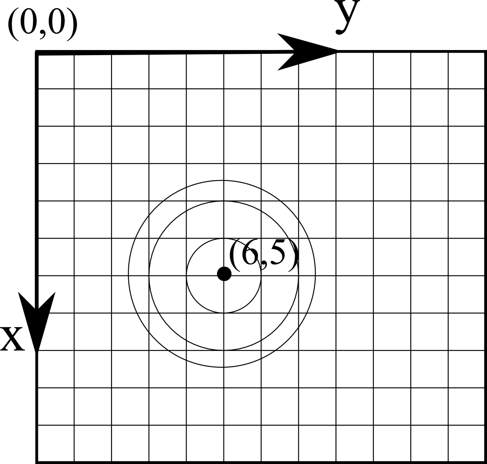

HoloPy Concepts
===============

.. _units:

Units
-----

HoloPy does **not** enforce any particular set of units. As long as
you are consistent, you can use any set of units, for example pixels,
meters, or microns.  So if you specify the wavelength of your red imaging
laser as 658 then all other units (*x*, *y*, *z* position coordinates,
particle radii, etc.)  must also be specified in nanometers.

.. _coordinate_system: 

Coordinate System
-----------------

For image data (data points arrayed in a
regular grid in a single plane), HoloPy defaults to placing the
origin, (0,0), at the top left corner as shown below. The x-axis runs
vertically down, the y-axis runs horizontally to the right, and the
z-axis points out of the screen, toward you.  This corresponds to the
way that images are treated by most computer software.

In sample space, we choose the z axis so that distances to objects
from the camera/focal plane are positive (have positive z
coordinates).  The price we pay for this choice is that the
propagation direction of the illumination light is then negative.
In the image above, light travels from a source located in front of the screen, through a scatterer, and onto a detector behind the screen.

More complex detector geometries will define their own origin, or ask
you to define one.
	
.. _rotations:

Rotations of Scatterers
-----------------------
Certain scattering calculations in HoloPy require specifying the orientation
of a scatterer (such as a Janus sphere) relative to the HoloPy coordinate
system. We do this in the most general way possible by specifying three
Euler angles and a reference orientation. Rotating a scatterer initially
in the reference orientation through the three Euler angles :math:`\alpha`,
:math:`\beta`, and :math:`\gamma` (in the active transformation picture)
yields the desired orientation. The reference orientation is specified by the 
definition of the scatterer.

The Euler rotations are performed in the following way:

1. Rotate the scatterer an angle :math:`\alpha` about the HoloPy :math:`z` axis.
2. Rotate the scatterer an angle :math:`\beta` about the HoloPy :math:`y` axis.
3. Rotate the scatterer an angle :math:`\gamma` about the HoloPy :math:`z` axis.

The sense of rotation is as follows: each angle is a rotation in the *clockwise*
direction about the specified axis, viewed along the positive direction of the axis from
the origin. This is the usual sense of how rotations are typically defined in math:

.. image:: ../images/euler_matrix_eqn.png
   :scale: 100 %
   :alt: Matrix equation for Euler rotations.

