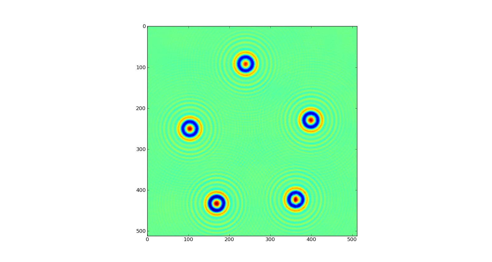
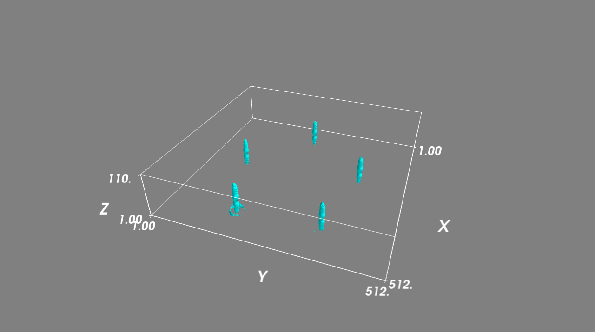

.. _recon_tutorial:

*****************
Reconstruction
*****************

Import the code
===============

To begin, import the :mod:`holopy.analyze.reconstruct` module. ::

    import holopy
    from holopy.analyze.reconstruct import reconstruct

:func:`holopy.reconstruct` is also provided as an alias to :func:`holopy.analyze.reconstruct.reconstruct` 

Load a hologram
==================

The first thing to do is to create a :class:`holopy.hologram.Hologram`
object which will store the image data of the hologram as well as
metadata about the optics used in creating the hologram.  See
:ref:`loading` and :ref:`metadata`.  Usually you will specify the
imaging laser wavelength, the medium refractive index, and the pixel
size of the camera as the metadata.

Reconstruct the hologram
========================
To reconstruct an x-y slice you must pass (at least) the hologram and the
z-distance of the reconstructed image to the function
:func:`holopy.analyze.reconstruct.reconstruct`

In the following bit of code, an image 10 microns from the focal plane
is reconstructed. The reconstruct function returns a
:class:`holopy.analyze.reconstruct.Reconstruction` instance. Like with
the :class:`holopy.hologram.Hologram` instance, this can be treated
like a numpy array.

.. sourcecode:: ipython

    In [4]: rec_xy = reconstruct(holo, 10e-6)

    In [5]: pylab.imshow(abs(rec_xy[:,:,0,0] * scipy.conj(rec_xy[:,:,0,0])))

    In [6]: rec_xy.shape
    Out[6]: (1024L, 1024L, 1L, 1L)

    In [7]: rec_xy.dtype
    Out[7]: dtype('complex128')

The reconstructed image is a four dimensional complex array. The
dimensions of the imaging plane (x&y) are the first two
dimensions. The next two are z - the distance normal to the imaging
plane) and t (time).

.. note::
    The reconstructed array is complex. In the code above the
    intensity of the reconstructed field was displayed. But one could
    also show the phase or just the imaginary component of the
    reconstructed field. For example:

    .. sourcecode:: ipython

        In [8]: pylab.imshow(scipy.angle(rec_xy[:,:,0,0]))

        In [9]: pylab.imshow(scipy.imag(rec_xy[:,:,0,0]))

Visualize the reconstruction
============================

Now that you have the reconstruction, you need to view it. A few 
resources come in handy when visualizing and working with the
reconstructions.

The functions in `matplotlib <http://matplotlib.sourceforge.net/>`_
are great for displaying 2D images and making plots. One of those functions,
``pylab.imshow``, was demontrated above. Other functions exist for creating
plots, histograms, contour plots and other figures.

Also of potential use are the functions within the ``scipy.ndimage`` package.
This package includes a number of image processing tools such as erosion and
dilation operations, Gaussian and Fourier filters and extracting statistics
on images.

Finally, `MayaVI <http://code.enthought.com/projects/mayavi/>`_ is great
for working with and visualizing three-dimensional data sets. We suggest
looking through the documentation there. But below is a preview of how
one can use MayaVi with our code.

Demo of visualizing reconstructions
-----------------------------------

In the following example we use the hologram from 5 micron-scale
particles displayed below.

::

    import holopy
    from holopy.analyze import reconstruct
    import scipy
    import pylab
    from enthought.mayavi import mlab
    opts = holopy.optics.Optics(wavelen=658e-9, index=1.414, pixel_scale = \
                                [0.07e-6, 0.07e-6])
    my_holo = holopy.io.load('image1180.tif', bg='background.tif', optics=opts)

You can take a look at a portion of the hologram with::

    holo_portion = my_holo[333-256:333+256, 415-256:415+256]
    pylab.imshow(holo_portion)

And that portion can be reconstructed. We reconstruct and view a 2D slice
10 microns from the hologram plane::

    rec = reconstruct(holo_portion, 10e-6)
    pylab.imshow(abs(rec[:,:,0,0]*scipy.conj(rec[:,:,0,0])))

Now, to reconstruct a volume over a range from 1 to 12 microns in steps of 100nm::

    rec_volume = reconstruct(holo_portion, scipy.arange(1e-6,12e-6,0.1e-6))

To display a contour surface of the intensity of the reconstructed volume::

    from enthought.mayavi import modules
    mlab.contour3d(abs(rec_volume[:,:,:,0]*scipy.conj(rec_volume[:,:,:,0])))
    engn = mlab.get_engine()
    engn.add_module(modules.outline.Outline())
    engn.add_module(modules.axes.Axes())

And the output would look something like this

